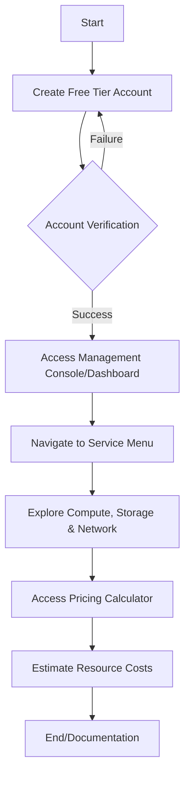

# Practical 1: Introduction to Cloud Platforms

## Aim
[span_0](start_span)To familiarize students with the major Public Cloud Service Providers (CSPs)—Amazon Web Services (AWS), Microsoft Azure, and Google Cloud Platform (GCP)—and to navigate their management consoles, core services, and pricing models.[span_0](end_span)

## Theory
[span_1](start_span)Cloud computing platforms provide on-demand delivery of IT resources via the internet with pay-as-you-go pricing.[span_1](end_span) [span_2](start_span)Instead of buying and maintaining physical data centers, users access technology services such as computing power, storage, and databases.[span_2](end_span)

### Leading Cloud Providers
* **[span_3](start_span)AWS (Amazon Web Services):** The most mature platform, offering a vast array of global services.[span_3](end_span)
* **[span_4](start_span)Microsoft Azure:** Deeply integrated with Microsoft software and enterprise environments.[span_4](end_span)
* **[span_5](start_span)GCP (Google Cloud Platform):** Known for high-performance computing, data analytics, and machine learning.[span_5](end_span)

## Account screenshot

## Core Service Categories
* **[span_6](start_span)Compute:** Virtual servers that process data (e.g., EC2, Virtual Machines).[span_6](end_span)
* **[span_7](start_span)Storage:** Systems to save and retrieve data (e.g., S3, Blob Storage).[span_7](end_span)
* **[span_8](start_span)Networking:** Tools to connect cloud resources (e.g., VPC, Virtual Networks).[span_8](end_span)
* **[span_9](start_span)Identity and Access Management (IAM):** Security frameworks for user permissions.[span_9](end_span)

### Resource Identification Table
| Service Category | AWS Service | Azure Service | GCP Service |
| :--- | :--- | :--- | :--- |
| Virtual Servers | Amazon EC2 | Azure Virtual Machines | Compute Engine |
| Object Storage | Amazon S3 | Azure Blob Storage | Cloud Storage |
| Database (SQL) | Amazon RDS | Azure SQL Database | Cloud SQL |
| Networking | Amazon VPC | Azure Virtual Network | VPC Network |
| Serverless | AWS Lambda | Azure Functions | Cloud Functions |
[span_10](start_span)

## Operational Flowchart

### Configuration Parameters for Free Tier

| Platform | Validation Method | Key Free Tier Limit |
| :--- | :--- | :--- |
| AWS | Credit/Debit Card | 12 Months (750 hours EC2/mo) |
| Azure | Credit/Debit Card | 12 Months + Initial Credits |
| GCP | Credit/Debit Card | 90 Days + $300 Credit |
## Conclusion
The fundamental interfaces and service hierarchies of AWS, Azure, and GCP were successfully explored. The exercise established an understanding of how to manage cloud resources and utilize cost-estimation tools to maintain budget compliance.  
