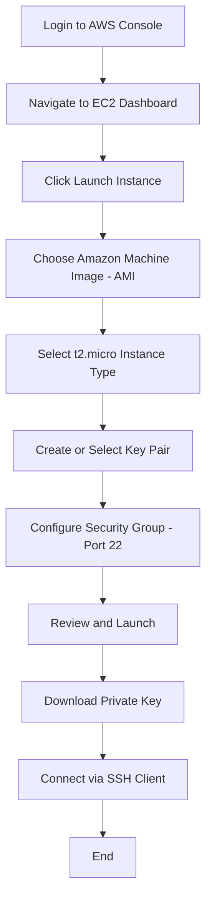

# Practical 2: Launch Your First Amazon EC2 Instance

## Aim

To provision and deploy a virtual machine (EC2 instance) on the Amazon Web Services (AWS) cloud platform and establish a remote connection via Secure Shell (SSH).

---

## Theory

Amazon Elastic Compute Cloud (EC2) is a web service that provides secure, resizable compute capacity in the cloud. It reduces the time required to obtain and boot new server instances to minutes, allowing for quick scaling of capacity as your requirements change.

### Key Components

**AMI (Amazon Machine Image):**  
A template that contains the software configuration (operating system, application server, and applications) required to launch your instance.

**Instance Types:**  
Various combinations of CPU, memory, storage, and networking capacity for your instances.

**Key Pairs:**  
A security credential consisting of a public key that AWS stores and a private key file that you store. They allow you to connect to your instance securely.

**Security Groups:**  
Acts as a virtual firewall for your instance to control inbound and outbound traffic.

---

## Instance Configuration Table

| Parameter | Recommended Value | Description |
|-----------|------------------|-------------|
| Name Tag | Cloud-Lab-01 | A label to identify the resource. |
| OS (AMI) | Amazon Linux 2023 | A free-tier eligible, stable Linux distribution. |
| Instance Type | t2.micro / t3.micro | Provides 1 vCPU and 1 GiB memory (Free Tier). |
| Key Pair | RSA (.pem or .ppk) | Required for encrypted authentication. |
| Security Group | Allow SSH (Port 22) | Permits remote terminal access from your IP. |
| Storage | 8 GB gp3 | General Purpose SSD root volume. |

---

## Operational Flowchart



---
## E2c service


## Security Group Rules (Inbound)

| Type | Protocol | Port Range | Source | Purpose |
|------|----------|------------|--------|---------|
| SSH | TCP | 22 | My IP | Allows remote terminal access. |
| HTTP | TCP | 80 | 0.0.0.0/0 | Allows web traffic (optional). |

---

## Prerequisites for Connection

### For Windows
- Use PuTTY (requires `.ppk` conversion)
- Or OpenSSH via Command Prompt

### For Linux/macOS
- Use the native Terminal

### Command Syntax

```bash
ssh -i "your-key.pem" ec2-user@<Public-IPv4-DNS>
```

---

## Conclusion

A Linux-based virtual server was successfully deployed on AWS infrastructure. By configuring security groups and utilizing RSA key pairs, a secure communication channel was established between the local machine and the cloud-hosted instance.
