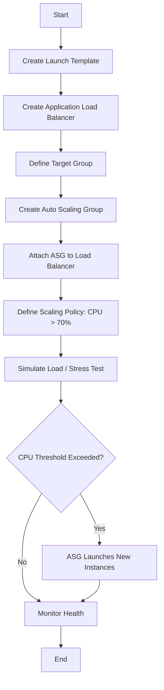

# Practical 4: Configure Auto Scaling and Load Balancing

## Aim

To implement a highly available and scalable architecture using Amazon EC2 Auto Scaling and an Application Load Balancer (ALB) to maintain application performance during varying traffic loads.

---

## Theory

High availability and elasticity are core pillars of cloud computing. This practical utilizes two synchronized services:

**Application Load Balancer (ALB):**  
Functions at the application layer (Layer 7) to route incoming HTTP/HTTPS traffic across multiple targets (EC2 instances) in different Availability Zones.

**Auto Scaling Group (ASG):**  
A collection of EC2 instances treated as a logical grouping for the purposes of automatic scaling and management.

**Scaling Policy:**  
A set of instructions that tells the ASG when to launch (scale out) or terminate (scale in) instances based on metrics like CPU utilization or request count.

---

## System Architecture Table

| Component | Setting/Value | Purpose |
|------------|---------------|----------|
| Launch Template | Amazon Linux 2, t2.micro | Defines the "gold image" for new instances. |
| Target Group | Protocol: HTTP, Port: 80 | Group of instances receiving ALB traffic. |
| Health Check | Path: /index.html, Interval: 30s | Monitors if instances are "Healthy" or "Unhealthy". |
| Scaling Policy | Target Tracking (CPU @ 70%) | Maintains average CPU load by adding/removing nodes. |
| Desired Capacity | 2 | The standard number of running instances. |

---

## Operational Flowchart



---

## Code Section: Load Simulation (Stress Test)

To test the scaling policy, use the stress utility on one of the EC2 instances to artificially spike CPU utilization.

### 1. Install and Run Stress on Linux Instance

```bash
# Connect to your EC2 instance via SSH

sudo amazon-linux-extras install stress -y

# Run stress to consume 100% CPU for 300 seconds
# This will trigger the Auto Scaling policy

stress --cpu 8 --timeout 300s
```

---

### 2. Verify via CLI (Optional)

```bash
# Check the status of instances in the ASG

aws autoscaling describe-auto-scaling-groups --auto-scaling-group-name My-ASG-Name
```

---

## Conclusion

By integrating an Application Load Balancer with an Auto Scaling Group, the infrastructure successfully demonstrated self-healing and elasticity. The ALB ensured traffic was distributed evenly, while the ASG successfully provisioned additional resources in response to simulated high CPU demand.
