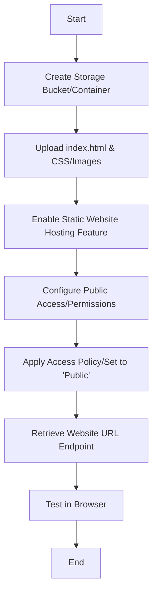

# Practical 5: Deploying a Static Website on the Cloud

## Aim

To deploy and host a static website (HTML/CSS) using cloud object storage services (AWS S3, Azure Blob Storage, or GCP Cloud Storage) and manage public access permissions for global reach.

---

## Theory

Cloud storage services are designed for highly durable object storage, but they also include a feature called **Static Website Hosting**. This allows the storage bucket to act as a web server for client-side content.

**Serverless Hosting:**  
There is no underlying virtual machine or web server (like Apache) to manage.

**Scalability:**  
The cloud provider automatically handles traffic spikes.

**Cost-Effectiveness:**  
You only pay for the storage used and the data transferred to users.

---

## Multi-Platform Comparison Table

| Feature | AWS S3 | Azure Blob Storage | GCP Cloud Storage |
|----------|--------|-------------------|-------------------|
| Storage Unit | Bucket | Container | Bucket |
| Primary File | index.html | index.html | index.html |
| Access Control | Bucket Policy (JSON) | Access Level (Public) | IAM / ACLs |
| Endpoint Format | bucket-name.s3-website... | account.zXX.web.core... | storage.googleapis.com/... |

---

## Operational Flowchart



---

## Code Section: Access Policy Configuration

### 1. AWS S3 Bucket Policy (JSON)

Used to grant "Read" permission to the public.

```json
{
    "Version": "2012-10-17",
    "Statement": [
        {
            "Sid": "PublicReadGetObject",
            "Effect": "Allow",
            "Principal": "*",
            "Action": "s3:GetObject",
            "Resource": "arn:aws:s3:::your-bucket-name/*"
        }
    ]
}
```

---

### 2. Simple Website Template (index.html)

```html
<!DOCTYPE html>
<html>
<head>
    <title>Cloud Hosted Site</title>
    <style>
        body { 
            font-family: 'Segoe UI', sans-serif; 
            background: #2c3e50; 
            color: white; 
            text-align: center; 
            padding-top: 50px; 
        }
        .container { 
            border: 2px solid #3498db; 
            display: inline-block; 
            padding: 20px; 
            border-radius: 10px; 
        }
    </style>
</head>
<body>
    <div class="container">
        <h1>Static Site Deployed!</h1>
        <p>This content is served directly from Cloud Object Storage.</p>
    </div>
</body>
</html>
```

---

## Security Checklist

- **Block Public Access:** Ensure "Block all public access" is turned **OFF** in the cloud console settings, otherwise the policy will be overridden.
- **Endpoint:** Always use the specific **Website Endpoint** provided in the properties tab, not the standard S3 Object URL.

---

## Conclusion

The static website was successfully hosted without the need for traditional server management. By configuring the storage bucket's permissions and enabling the web-hosting property, the site became globally accessible via a unique cloud-provided URL.
