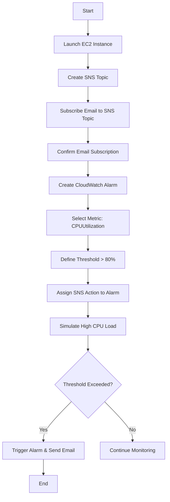

# Practical 6: Monitor Resources Using AWS CloudWatch

## Aim

To implement a proactive monitoring and alerting system for AWS infrastructure using Amazon CloudWatch and Simple Notification Service (SNS) to track performance metrics and automate notifications.

---

## Theory

Amazon CloudWatch is a monitoring and observability service that provides data and actionable insights to monitor applications, respond to system-wide performance changes, and optimize resource utilization.

**Metrics:**  
Time-ordered data points that represent the state of a resource (e.g., CPU, Network In/Out, Disk Read/Write).

**Alarms:**  
Watches a single metric over a specified time period and performs one or more actions based on the value of the metric relative to a threshold.

**SNS (Simple Notification Service):**  
A managed service that provides message delivery from publishers to subscribers (e.g., sending an email when an alarm is triggered).

---

## Monitoring Configuration Table

| Component | Setting/Value | Description |
|------------|---------------|-------------|
| Metric Name | CPUUtilization | The percentage of allocated EC2 compute units currently in use. |
| Statistic | Average | The average value of the metric over the period. |
| Period | 5 Minutes | The granularity of the data points. |
| Threshold Type | Static | Triggers when the value is greater than a specific number. |
| Threshold Value | 80% | The limit at which the alarm state changes to ALARM. |
| SNS Topic | CloudWatch_Alerts | The communication channel for email delivery. |

---

## Operational Flowchart



---

## Code Section: Stress Simulation & Verification

### 1. Install Stress Utility on EC2 (Linux)

```bash
# Connect to EC2 via SSH

sudo amazon-linux-extras install stress -y

# Run stress to spike CPU to 90%+ for 10 minutes
# This will force the CloudWatch Alarm into 'ALARM' state

stress --cpu 4 --timeout 600s
```

---

### 2. AWS CLI Command to Check Alarm Status

```bash
# Check the state of your alarm via terminal

aws cloudwatch describe-alarms --alarm-names "Your-Alarm-Name" --query "MetricAlarms[].StateValue"
```

---

## Notification Workflow

- **State: OK** – Metric is within the normal range (< 80%).
- **State: ALARM** – Metric exceeded 80% for the specified period; SNS sends an email to the administrator.
- **State: INSUFFICIENT_DATA** – The alarm has just started, or the metric is not available.

---

## Conclusion

An automated monitoring system was successfully configured. By integrating CloudWatch Alarms with SNS, the system demonstrated the ability to detect high CPU utilization and immediately notify the administrator via email, ensuring minimal downtime and proactive resource management.
