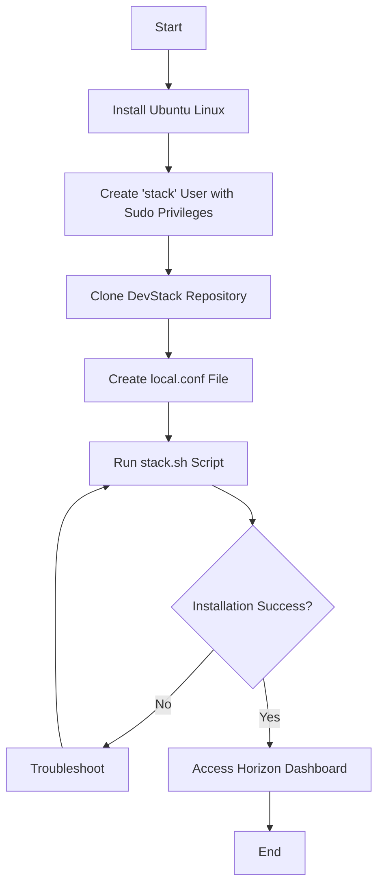

# 🧪 Practical 7: Install OpenStack (Local Environment)

## 🎯 Aim
To install and configure a local OpenStack environment using DevStack to understand Infrastructure as a Service (IaaS) components and management.

---

## 📖 Theory
OpenStack is a free, open-source cloud computing platform that provides Infrastructure as a Service (IaaS). It helps manage compute, storage, and networking resources through a dashboard or APIs.

### 🔑 Key Components
- **Keystone (Identity):** Authentication and authorization  
- **Nova (Compute):** Virtual machine management  
- **Neutron (Networking):** Network services (IP, routers, subnets)  
- **Glance (Image):** Stores VM images  
- **Horizon (Dashboard):** Web interface  
- **Cinder (Block Storage):** Persistent storage  

---

## 💻 System Requirements

| Resource   | Minimum Requirement | Recommended |
|------------|-------------------|------------|
| OS         | Ubuntu 22.04 LTS  | Ubuntu 24.04 LTS |
| Processor  | 2 Cores           | 4 Cores |
| RAM        | 8 GB              | 16 GB |
| Storage    | 20 GB             | 40 GB+ |
| Network    | Internet Access   | Static IP |

---

## 🔄 Operational Flowchart


## ⚙️ Installation Commands
### 1️⃣ Create Stack User
```bash
sudo useradd -s /bin/bash -d /opt/stack -m stack
echo "stack ALL=(ALL) NOPASSWD: ALL" | sudo tee /etc/sudoers.d/stack
sudo -u stack -i
```

### 2️⃣ Clone DevStack & Configure
```bash
git clone https://opendev.org/openstack/devstack
cd devstack
```

Create `local.conf`:
```bash
cat <<EOF > local.conf
[[local|localrc]]
ADMIN_PASSWORD=password
DATABASE_PASSWORD=$ADMIN_PASSWORD
RABBIT_PASSWORD=$ADMIN_PASSWORD
SERVICE_PASSWORD=$ADMIN_PASSWORD
HOST_IP=127.0.0.1
EOF
```

### 3️⃣ Run Installer
```bash
./stack.sh
```
## 🌐 Service Endpoints
| Service |	Access URL |	Port |
|------------|-------------------|------------|
| Horizon Dashboard	| http://<HOST_IP>/dashboard	| 80 / 443 |
| Keystone API |	http://<HOST_IP>/identity |	5000 |
| Nova Compute	| CLI / Dashboard |	8774 |

## ✅ Conclusion
A functional OpenStack environment was successfully deployed using DevStack. This setup allows practice of cloud operations like:

- Creating virtual machines  
- Managing networks  
- Configuring security policies  

It provides a cost-free local cloud sandbox.
