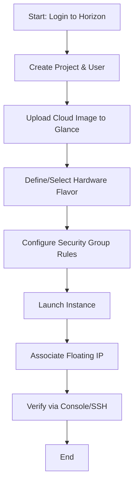

# Practical 8: Launch Your First Instance in OpenStack

## Aim
To provision a virtual machine (instance) within a local OpenStack environment by managing projects, images, flavors, and security settings.

---

## Theory
In OpenStack, launching an instance involves coordinating several modular services to create a functional virtual resource.

- **Keystone (Identity):** Manages multi-tenancy by grouping users into Projects (Tenants).
- **Glance (Image Service):** Acts as a repository for virtual disk images used as templates for VMs.
- **Nova (Compute):** The primary engine that handles the lifecycle of the instance (scheduling, creation, and deletion).
- **Flavor:** A virtual hardware template that defines the size of the VM (RAM, VCPUs, and Disk).
- **Neutron (Networking):** Provides the virtual network interface for the instance to communicate.

---

## Resource Specification Table

| Component        | Example Value            | Purpose                                      |
|------------------|-------------------------|----------------------------------------------|
| Project Name     | Lab-Project-01          | Logical grouping for resource isolation      |
| Image Name       | Ubuntu-22.04-Cloud      | The OS template (usually in .qcow2 format)   |
| Flavor Name      | m1.tiny / m1.small      | Hardware allocation (RAM, VCPU, Disk)        |
| Network          | shared-net / private    | Virtual network attachment                   |
| Security Group   | default                 | Allows ICMP (Ping) and SSH (Port 22)         |

---

## Operational Flowchart

## Code Section: CLI Operations
# Create a Project
openstack project create --description "Cloud Lab Project" Lab-Project-01

# Create a custom Flavor (1 vCPU, 1GB RAM, 10GB Disk)
openstack flavor create --id 1 --ram 1024 --disk 10 --vcpus 1 m1.lab

# Upload Ubuntu Image to Glance
openstack image create "Ubuntu-Cloud" \
  --file focal-server-cloudimg-amd64.img \
  --disk-format qcow2 --container-format bare --public

# Launch the Instance
openstack server create --flavor m1.lab --image Ubuntu-Cloud \
  --network private --security-group defaul
  
## Conclusion

A virtual machine was successfully deployed within the OpenStack private cloud. By configuring the necessary identity roles, disk images, and hardware flavors, the instance was transitioned to an active state, demonstrating the fundamental workflow of an IaaS provider.t My-First-Instance
